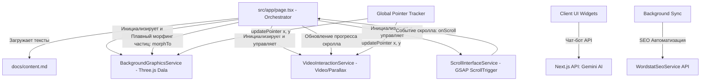

# Системная спецификация: Архитектура интерактивного портфолио

Этот документ определяет общую архитектуру, принципы взаимодействия и визуальную концепцию интерактивного портфолио в стиле **белого цифрового минимализма** (смесь Matrix и Detroit: Become Human).

---

## 1. Концепция и дизайн-система

### Эстетика: Белый цифровой минимализм (Digital Blueprint)
*   **Фоновое пространство**: Абсолютно белый цвет (`#ffffff` или `#fbfbfb`), создающий ощущение стерильности, легкости и обилия воздуха.
*   **Сетка и частицы**: Микрочастицы (1-2px) и тончайшие линии (border 0.5px) платинового, светло-серого (`#e5e5e5`) или холодного стального цвета.
*   **Типографика**: Использование шрифта *Archivo* для крупных заголовков, футуристичного гротеска *Space Grotesk* для основного текста и моноширинного шрифта (*JetBrains Mono*) для технических надписей, цифр и статусов.
*   **Интерфейсы**: Прозрачные стеклянные панели (`backdrop-blur`) с тонкими светлыми границами. Микро-анимации линий и круговых индикаторов при наведении.

### Структура разделов портфолио
Все материалы и тексты берутся из внешнего файла `docs/content.md`. Скролл на странице должен быть вертикальный и горизонтальный, при этом горизонтальный скролл используется только в разделе "О себе". Портфолио состоит из ключевых секций:
1.  **Intro (Главная)**: Крупный заголовок, фоновое видео с силуэтом, векторное поле частиц Dala. При повороте головы на видео формируется Синяя или Красная 3D-таблетка («Матрица»).
2.  **Education (Образование)**: Блоки обучения. Частицы на фоне перестраиваются в аккуратные концентрические кольца.
3.  **Experience (Опыт работы)**: Хронологический таймлайн разработчика. Частицы выстраиваются в вертикальные оси времени.
4.  **About / Tech Stack (О себе и стек)**: Информация о навыках. Горизонтальный скролл плавно трансформирует частицы в геометрические 3D-фигуры (сфера, куб, тор).
5.  **Services & Cost (Стоимость услуг)**: Интерактивный калькулятор сметы. Сетка частиц становится более плотной и упорядоченной.
6.  **Contacts (Контакты)**: Форма связи, ИИ-Чатбот («Cyber Assistant») и баннер 152-ФЗ. Частицы медленно рассеиваются и притягиваются к интерфейсу.

---

## 2. Архитектура сервисов

Система построена на базе изолированных UI-сервисов и API-роутов. Сервисы общаются через прямые вызовы API (Approach 1) для обеспечения максимального FPS и предотвращения лишних ре-рендеров React. Также добавлены серверные ИИ-сервисы.



### Спецификация общих интерфейсов

```typescript
// Общие типы данных для взаимодействия сервисов
export interface PointerCoords {
  x: number; // Нормализованная координата X (-1 to 1)
  y: number; // Нормализованная координата Y (-1 to 1)
}

export interface ScrollState {
  progress: number;      // Общий прогресс скролла (0 to 1)
  activeSection: number; // Индекс текущей активной секции (0 to 4)
  sectionProgress: number; // Прогресс внутри текущей секции (0 to 1)
}
```

---

## 3. Точки интеграции GSAP

GSAP используется во всех сервисах для обеспечения плавной интерполяции данных и скролл-анимаций:
1.  **ScrollInterfaceService**: Использует `gsap.timeline()` и `ScrollTrigger` для трансформации стандартного вертикального скролла мыши/тачпада в горизонтальное смещение контейнера (`xPercent`).
2.  **BackgroundGraphicsService**: Использует GSAP для анимации параметров материалов Three.js и интерполяции позиций частиц (`gsap.to()`) при смене секций (морфинг).
3.  **VideoInteractionService**: Использует GSAP для скруббинга видео (`currentTime`) и сглаживания параллакса видео-контейнера.

---

## 4. Верификационные требования и Performance

*   **Target FPS**: 60 FPS на десктопах и мобильных устройствах средней производительности.
*   **Память**: Отсутствие утечек памяти при переключении страниц и ресайзе. Все инстансы сервисов должны вызывать метод `destroy()` при размонтировании.
*   **React**: Исключить использование состояния React (`useState`, `useContext`) для передачи высокочастотных данных (координаты мыши, кадры анимации). Для этих целей используются прямые ссылки (`useRef`) и методы классов.

---

## 5. Использование JS-бандлера и сборка проекта

Для компиляции, оптимизации и сборки интерактивного портфолио используется экосистема фреймворка **Next.js** со встроенными инструментами сборки.

### 5.1 Режимы сборщика и HMR
*   **Режим разработки (Development)**: Запуск локального сервера разработки осуществляется командой `npm run dev` с использованием **Turbopack**. Это обеспечивает мгновенный запуск и сверхбыструю инкрементальную сборку при изменении кода (Fast Refresh / Hot Module Replacement), что критически важно при тонкой настройке анимаций и Three.js сцен.
*   **Режим сборки (Production)**: При вызове команды `npm run build` проект компилируется в оптимизированный продакшн-бандл. Бандлер автоматически выполняет минификацию JS/CSS-кода, оптимизацию шрифтов, разделение на чанки (code splitting) и генерирует статические файлы.

### 5.2 Конфигурация и разрешение зависимостей
*   **TypeScript и разрешение модулей**: В конфигурационном файле [tsconfig.json](file:///c:/mp/portfolio/tsconfig.json) задана опция `"moduleResolution": "bundler"`. Это гарантирует, что TypeScript будет сопоставлять импорты точно так же, как современный JS-бандлер, поддерживая package exports, относительные пути без расширений файлов и бесконтекстную интеграцию библиотек из `node_modules`.
*   **React Compiler**: В [next.config.ts](file:///c:/mp/portfolio/next.config.ts) активирован флаг `reactCompiler: true`. Это позволяет компилятору автоматически мемоизировать компоненты (эквивалент автоматического применения `useMemo` и `useCallback`), минимизируя холостые ре-рендеры React-компонентов.
*   **Стилизация**: Tailwind CSS v4 интегрирован через компилятор стилей `@tailwindcss/postcss` в [postcss.config.mjs](file:///c:/mp/portfolio/postcss.config.mjs), что ускоряет сборку стилей и позволяет использовать CSS-переменные напрямую.

### 5.3 Оптимизация размера бандла и ассетов
*   **Code Splitting и Lazy Loading**: Так как графические (Three.js) и анимационные (GSAP) библиотеки имеют значительный вес, для предотвращения блокировки основного потока при первой отрисовке (First Contentful Paint) используется динамический импорт на стороне клиента (`next/dynamic` или динамический `import()`). Модули, зависимые от этих библиотек, должны инициализироваться только после загрузки страницы в браузере.
*   **Статический контент**: Видео и медиа-ассеты для сервиса `VideoInteractionService` хранятся в директории `/public` и раздаются сервером напрямую без участия JS-бандлера, снижая нагрузку на процесс сборки.
