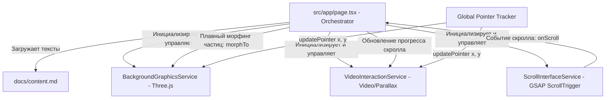

# Системная спецификация: Архитектура интерактивного портфолио

Этот документ определяет общую архитектуру, принципы взаимодействия и визуальную концепцию интерактивного портфолио в стиле **белого цифрового минимализма** (смесь Matrix и Detroit: Become Human).

---

## 1. Концепция и дизайн-система

### Эстетика: Белый цифровой минимализм (Digital Blueprint)
*   **Фоновое пространство**: Абсолютно белый цвет (`#ffffff` или `#fbfbfb`), создающий ощущение стерильности, легкости и обилия воздуха.
*   **Сетка и частицы**: Микрочастицы (1-2px) и тончайшие линии (border 0.5px) платинового, светло-серого (`#e5e5e5`) или холодного стального цвета.
*   **Типографика**: Сочетание футуристичного гротеска для крупных заголовков (например, *Space Grotesk* или *Outfit*) и моноширинного шрифта для технических надписей, цифр и статусов (например, *JetBrains Mono*).
*   **Интерфейсы**: Прозрачные стеклянные панели (`backdrop-blur`) с тонкими светлыми границами. Микро-анимации линий и круговых индикаторов при наведении.

### Структура разделов портфолио
Все материалы и тексты берутся из внешнего файла `docs/content.md`. Горизонтальный скролл состоит из 5 ключевых секций:
1.  **Intro (Главная)**: Крупный заголовок, фоновое видео с силуэтом, разреженная сетка частиц, реагирующая на мышь.
2.  **Education (Образование)**: Блоки обучения. Частицы на фоне перестраиваются в аккуратные геометрические структуры/блоки.
3.  **Experience (Опыт работы)**: Хронологический таймлайн. Частицы выстраиваются в горизонтальные линии времени (оси).
4.  **About / Tech Stack (О себе и стек)**: Информация о навыках. Частицы собираются во вращающуюся 3D-сферу или спираль.
5.  **Contacts (Контакты)**: Форма связи и ссылки. Частицы медленно рассеиваются и притягиваются к кнопкам интерфейса.

---

## 2. Архитектура сервисов

Система построена на базе трех изолированных сервисов, управляемых центральным оркестратором (`src/app/page.tsx`). Сервисы общаются через прямые вызовы API (Approach 1) для обеспечения максимального FPS и предотвращения лишних ре-рендеров React.



### Спецификация общих интерфейсов

```typescript
// Общие типы данных для взаимодействия сервисов
export interface PointerCoords {
  x: number; // Нормализованная координата X (-1 to 1)
  y: number; // Нормализованная координата Y (-1 to 1)
}

export interface ScrollState {
  progress: number;      // Общий прогресс скролла (0 to 1)
  activeSection: number; // Индекс текущей активной секции (0 to 4)
  sectionProgress: number; // Прогресс внутри текущей секции (0 to 1)
}
```

---

## 3. Точки интеграции GSAP

GSAP используется во всех сервисах для обеспечения плавной интерполяции данных и скролл-анимаций:
1.  **ScrollInterfaceService**: Использует `gsap.timeline()` и `ScrollTrigger` для трансформации стандартного вертикального скролла мыши/тачпада в горизонтальное смещение контейнера (`xPercent`).
2.  **BackgroundGraphicsService**: Использует GSAP для анимации параметров материалов Three.js и интерполяции позиций частиц (`gsap.to()`) при смене секций (морфинг).
3.  **VideoInteractionService**: Использует GSAP для скруббинга видео (`currentTime`) и сглаживания параллакса видео-контейнера.

---

## 4. Верификационные требования и Performance

*   **Target FPS**: 60 FPS на десктопах и мобильных устройствах средней производительности.
*   **Память**: Отсутствие утечек памяти при переключении страниц и ресайзе. Все инстансы сервисов должны вызывать метод `destroy()` при размонтировании.
*   **React**: Исключить использование состояния React (`useState`, `useContext`) для передачи высокочастотных данных (координаты мыши, кадры анимации). Для этих целей используются прямые ссылки (`useRef`) и методы классов.
