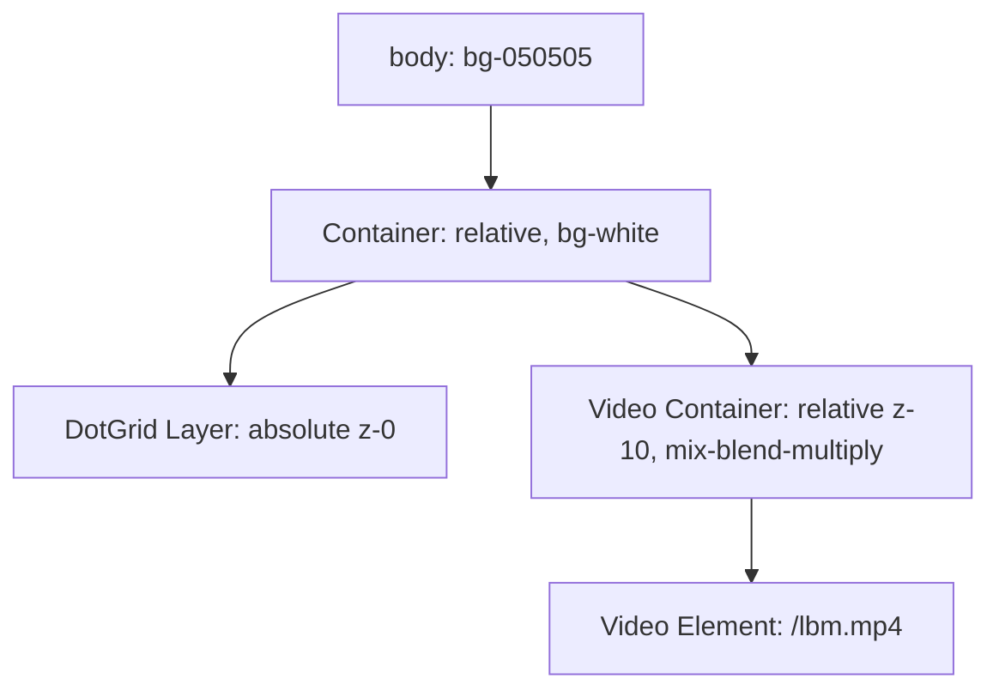

# Дизайн-спецификация: Интеграция интерактивного фона DotGrid

Этот документ описывает дизайн и технические детали внедрения интерактивного фона `DotGrid` из библиотеки React Bits в проект портфолио с интеграцией поверх видео силуэта человека.

## Архитектура и слои

Сетка точек (`DotGrid`) будет находиться на заднем плане, а интерактивное видео — на переднем плане. Мы используем CSS-эффект наложения для создания иллюзии обхода силуэта человека.

## Техническое решение

### 1. Компонент `DotGrid`
Мы создаем компонент `DotGrid` в `src/components/ui/DotGrid/` на TypeScript.
*   **Адаптация под свободный GSAP**: В связи с отсутствием коммерческой лицензии на `InertiaPlugin` от GSAP, физика движения точек при наведении/клике переписана с использованием стандартных кривых анимации `power3.out` (эффект отдаления) и `elastic.out(1, 0.75)` (плавный пружинистый возврат в исходное положение).
*   **Типизация**: Код полностью типизирован на TypeScript для совместимости с React 19.

### 2. Маскирование силуэта
Поскольку видео имеет белый фон, мы используем свойство `mix-blend-mode: multiply` (`mix-blend-multiply` в Tailwind) на контейнере видео:
*   Белый фон видео умножается на белый цвет страницы, становясь полностью прозрачным.
*   Темный силуэт человека умножается, сохраняя свою непрозрачность и перекрывая точки сетки.
*   Это позволяет точкам отображаться вокруг человека (огибать его), визуально находясь под ним.

---

## Изменения файлов

### [NEW] [DotGrid.css](file:///c:/mp/portfolio/src/components/ui/DotGrid/DotGrid.css)
Содержит базовые стили позиционирования для HTML5 Canvas, на котором отрисовываются точки.

### [NEW] [DotGrid.tsx](file:///c:/mp/portfolio/src/components/ui/DotGrid/DotGrid.tsx)
Компонент с логикой рендеринга сетки точек на Canvas, отслеживания мыши и анимации точек при приближении курсора.

### [MODIFY] [MouseFollowVideo.tsx](file:///c:/mp/portfolio/src/components/MouseFollowVideo.tsx)
Изменение разметки для внедрения `DotGrid` на задний план и добавление класса `mix-blend-multiply` к видео-контейнеру.

---

## План верификации

### Ручное тестирование
1. Запустить сервер разработки `npm run dev`.
2. Открыть `http://localhost:3000`.
3. Убедиться, что точки отображаются на фоне.
4. Проверить, что при движении мыши точки огибают курсор и исчезают за телом человека на видео.
5. Проверить отсутствие ошибок в консоли браузера.
